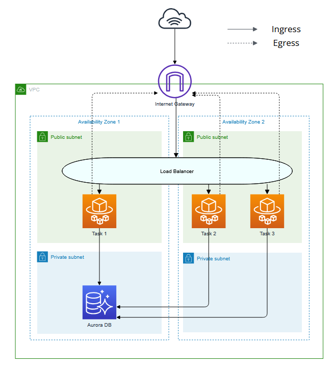
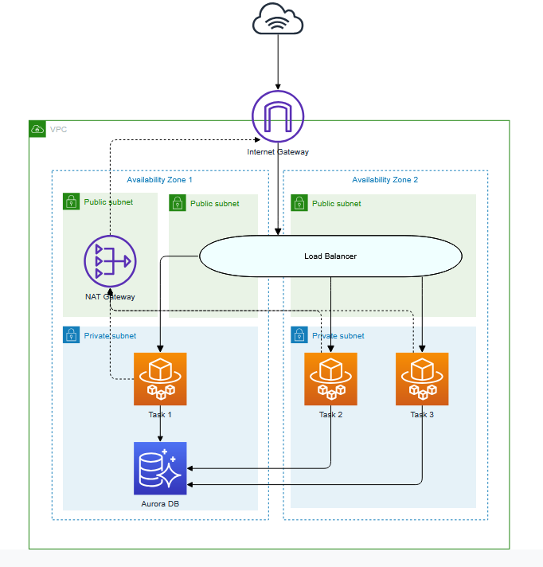

# 9. Cloud architecture

Date: 2025-02-26

## Status

Accepted

## Context

Terraform allows for much greater flexibility to define the cloud architecture than AWS Copilot. 
This is the architecture as it was created by AWS Copilot:

* The ECS tasks are running in public subnets, which is not ideal from a security perspective
* Each of the tasks has a public IP address assigned allowing tasks to initiate outgoing connections to the internet
   * This means there are multiple routes of traffic out of the service
   * This is a security risk as it exposes another potential point of attack
* Security group rules for the ECS service are designed to limit incoming traffic only
  * Egress is unrestricted
  * Ingress only allows incoming connections from the load balancer

## Decision

We will implement the following architecture with Terraform:

## Consequences

Overall the architecture remains similar to the existing setup, with core components such as the load balancer, 
database, and VPC persisting. The main difference between the two architectures are:

1) Tasks are moved into the private subnets to restrict the ability to communicate with the containers directly.
   1) As a result there is no longer any public IP associated to the containers.
   2) We can be more restrictive with the allowed communication flows.
2) To allow outgoing connections to NHS services such as PDS, CIS2, and Splunk a NAT gateway is introduced.
   1) This will also make it seamless to introduce further safeguards like network firewalls in the future.
3) More restrictive ingress/egress rules are implemented explicitly allowing only pair-wise communication between services.
   1) E.g. no "allow all" ingress or egress rules are used for internal communication.
