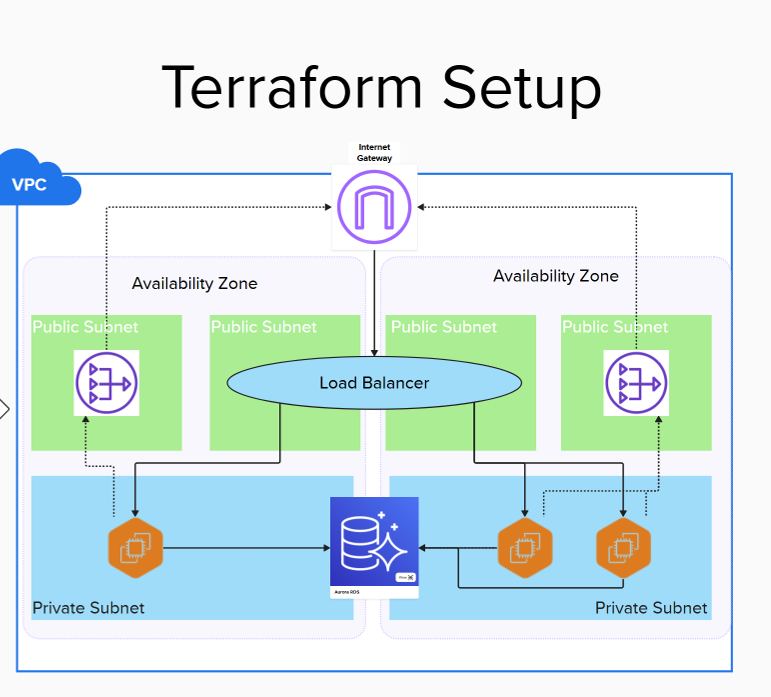

# 9. Cloud Architecture

Date: 2025-02-26

## Status

Accepted

## Context

Terraform allows for much greater flexibility to define the cloud architecture than AWS Copilot. 
This is the architecture as it was created by AWS Copilot:

The ECS tasks are running in public subnets, which is not ideal from a security perspective. Each of the tasks has a 
public IP address assigned which is not necessary as all traffic should go through the load balancer. Nevertheless, the traffic is restricted by security groups so that 
the tasks can only be accessed by the load balancer. 

## Decision

We will implement the following architecture with Terraform:

## Consequences

Overall the architecture remains similar to the existing setup, with core components such as the load balancer, database, and VPC persisting. The main difference between the two architectures are:

1) Tasks are moved into the private subnets to restrict the ability to communicate with the containers directly.
   As a result there is no longer any public IP associated to the containers and we can be more restrictive with the allowed communication flows.
2) To allow outgoing connections to NHS services such as PDS, CIS2, and Splunk a NAT gateway is introduced.
   This will also make it seamless to introduce further safe-guards like network firewalls in the future.
