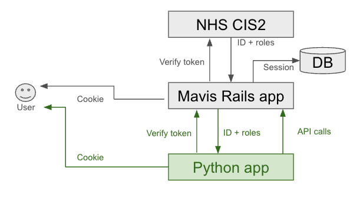

# 12. Authentication Pattern for Commissioner Reporting

Date: 2025-06-18

## Status

Proposed

## Context

The Mavis application currently supports two authentication methods - an integration with NHS CIS2 for use in production, and a locally-stored email/password for environments where CIS2 is not available, such as development on a local laptop.

To meet the reporting needs of the NHS commissioners and SAIS teams, a phase of work is underway to develop a reporting interface. This will be developed in Python, which is currently a 'MAINSTREAM' technology on the [NHSDigital Tech Radar](https://github.com/NHSDigital/tech-radar/blob/main/site/data/data.js#L150), as opposed to Ruby which is merely '[PROPOSED](https://github.com/NHSDigital/tech-radar/blob/main/site/data/data.js#L157)'.

This means that the reporting interface will be a separate process to the rest of the application, with its own distinct cookies. We will therefore need to establish a mechanism for user authentication which works transparently between the two processes.

### Desired Outcomes

1. The user should only have to sign in once, regardless of which application they visit first.
2. The authentication mechanism should work in the same way across all environments.

## Options

### Option 1 : Both apps share the same cookie

On a deployed environment, both apps would be running on the same domain behind an ECS Application Load Balancer acting as an ingress controller. This would make it possible for the same cookie to be read by both applications, if both apps could be made to use the same encryption mechanism and encryption secret.

Locally, this would be more difficult as the apps would be running on different ports, which is seen by the browser as a different hostname. It may be possible to work around this by creative use of the :domain property of the cookie, and/or the SameSite policy, etc. but we may hit issues with different restrictions/levels of support in different browsers. We would also be prone to changes in any of the above.

Pros:

- Conceptually the simplest, most lightweight option

Cons:

- Difficult to make it work across all environments
- Vulnerable to client-side changes in cookie policies, browser versions, etc
- Breaks the implicit model of cookies

### Option 2 : A second integration with NHS CIS2

We would need to duplicate all of the existing work on local authentication & CIS2 integration in Python.
This approach would probably need a second CIS2 onboarding process for the new application. This process is known to take a long time - around 3 months - and require careful shepherding through the approval process. We may also need a more rigorous assurance process for this approach.
If the user first logs in via CIS2 on one application and then visits the other, we may not be able to sufficiently hide the second roundtrip to CIS2 from them. This could be confusing for the users.

Pros:

- Most robust implementation
- Conceptually cleanest - uses CIS2 as an SSO mechanism, as intended

Cons:

- Requires duplication of integration work to implement and for subsequent maintenance
- Requires another lengthy and labour-intensive onboarding with CIS2
- Probably requires most detailed assurance

### Option 3 : Python app as an auth client of the main app

In this model, the python app has its own cookie for user session, but delegates authentication of the user to the main application via redirects, in a similar way to how the main app delegates to CIS2. A full discussion of the flow is explored in more detail in [this slide deck](./Proposed-authentication-process-for-Mavis-reporting-application.pptx), here we simply present the  and outline the user journeys below.

#### User visits the Ruby app first

The user would either not be logged in, in which case they would go through the existing login journey via CIS2 and be returned to their starting point, or if they are already logged-in, no further action is needed.

The user then visits the Python app:

If they already have a cookie identifying a valid session on the Python app, no further action is needed.
If they do not have a cookie, or their session has expired:

1. They are redirected to the login action on the Ruby app
2. The Ruby app detects their valid cookie for the Ruby app, stores a one-time token for their user id in the database, and redirects them back to the Python app with that token as a query param
3. The Python app validates the token via a server-side call to the Ruby app, gets their ID + roles in response, stores the ID + roles in session storage, and gives the user a cookie identifying that session.

#### User visits the Python app first

If the user is not logged in:

1. They are redirected to the Ruby app.
2. They either go through the existing login journey via CIS2, or are already logged in on the Ruby app.
3. The user is returned back to their starting point in the Python app with a token identifying their Ruby app session.
4. The Python app verifies that token via a server-side call to the Ruby app, receiving the ID + roles in response.
5. The Python app then saves the ID + roles to session storage, and responds with a cookie identifying that session.

If they are already logged-in, no further action is needed.

#### User logs in with a smartcard which they then remove

This already triggers a request from the CIS2 app to the Mavis Ruby app to log the user out of any existing session.
To extend this to the Python app, we simply need the existing Ruby app endpoint to also make a similar request to the Python app.

Pros:

- Transparent to the user - only existing user journeys needed.
- Works in the same way across all environments
- Does not require duplication of work already done
- Should be easier to assure than full re-implementation of CIS2 integration

Cons:

- the Ruby and Python apps would need a shared secret to ensure they are not passing user information in plain text between them
- medium implementation complexity

## Decision

We propose Option 3, as it provides the best combination of user experience, robustness against browser changes, and ease of implementation.

## Consequences

We will need to engage early with potential assurance decision-makers for guidance regarding assurance needs.
