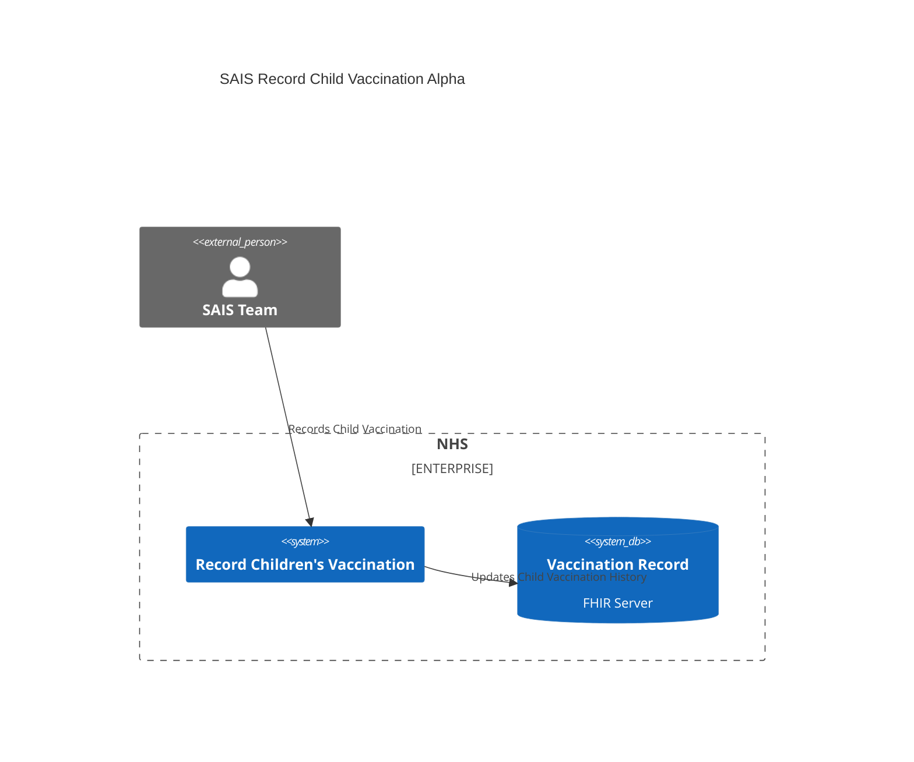

# Introduction and Goals

Provide a service to record childrens vaccinations in settings encountered by
SAIS staff.

## Requirements Overview

### Functional Requirements

A certain amount of user research, prototyping and design has already been
performed for this service. The goal of this system is to provide a
higher-fidelity prototype to further test out design and to better understand
user needs.

- Allow SAIS teams to deliver vaccination campaigns.
- Allow SAIS teams to record vaccinations administered to children as part of
  these campaigns.
- Allow SAIS teams to deliver campaigns in settings where there is no Internet
  access, i.e. offline working.

### Non-Functional Requirements

This service is in alpha and it's primary purpose is to explore user needs
through user research. Once the desired learnings have been achieved the system
will be considered disposable and will be replaced by a production-ready system.

- The system needs to be delivered in a short time frame, and to be flexible
  enough to adapt to changes as required by service design.
- The system must be responsive and available, however the number of users will
  be small so scalibility and hours of operation requirements will be relaxed.

## Stakeholders

| Role/Name   | Contact        | Expectations       |
| ----------- | -------------- | ------------------ |
| _\<Role-1>_ | _\<Contact-1>_ | _\<Expectation-1>_ |
| _\<Role-2>_ | _\<Contact-2>_ | _\<Expectation-2>_ |

# Architecture Constraints

- The system must protect patient data and comply with all applicable laws and
  regulations.
- The system will need to be compatible with the central vaccination record
  system.
- The system must be deployed to a cloud platform, but also be platform agnostic
  and not constrained to run on any one cloud platform.
- The system will adhere to the applicable NHS architecture and design principles.

# System Scope and Context

## Business Context



## Technical Context

```mermaid
C4Context
  title Record Childrens Vaccination Technical
  
  left to right direction
  
  System(browser, "Web Browser")
  
  Enterprise_Boundary(nhs, "NHS") {
    SystemDb(postgres, "PostgreSQL")
    System(record, "Record Children's Vaccination", "")
    SystemDb(vaccineRecord, "Vaccination Record", "FHIR Server")
  }
  
  Rel(browser, record, "Vaccination Record", "HTTPS")
  Rel(record, vaccineRecord, "Vaccination Record", "HTTPS")
  Rel(record, postgres, "Vaccination Record", "Postgres TLS")
```

# Solution Strategy

# Building Block View

## Whitebox Overall System

**_\<Overview Diagram>_**

Motivation  
_\<text explanation>_

Contained Building Blocks  
_\<Description of contained building block (black boxes)>_

Important Interfaces  
_\<Description of important interfaces>_

### \<Name black box 1>

_\<Purpose/Responsibility>_

_\<Interface(s)>_

_\<(Optional) Quality/Performance Characteristics>_

_\<(Optional) Directory/File Location>_

_\<(Optional) Fulfilled Requirements>_

_\<(optional) Open Issues/Problems/Risks>_

### \<Name black box 2>

_\<black box template>_

### \<Name black box n>

_\<black box template>_

### \<Name interface 1>

…

### \<Name interface m>

## Level 2

### White Box _\<building block 1>_

_\<white box template>_

### White Box _\<building block 2>_

_\<white box template>_

…

### White Box _\<building block m>_

_\<white box template>_

## Level 3

### White Box \<\_building block x.1\_\>

_\<white box template>_

### White Box \<\_building block x.2\_\>

_\<white box template>_

### White Box \<\_building block y.1\_\>

_\<white box template>_

# Runtime View

## \<Runtime Scenario 1>

- _\<insert runtime diagram or textual description of the scenario>_

- _\<insert description of the notable aspects of the interactions
  between the building block instances depicted in this diagram.>_

## \<Runtime Scenario 2>

## …

## \<Runtime Scenario n>

# Deployment View

## Infrastructure Level 1

**_\<Overview Diagram>_**

Motivation  
_\<explanation in text form>_

Quality and/or Performance Features  
_\<explanation in text form>_

Mapping of Building Blocks to Infrastructure  
_\<description of the mapping>_

## Infrastructure Level 2

### _\<Infrastructure Element 1>_

_\<diagram + explanation>_

### _\<Infrastructure Element 2>_

_\<diagram + explanation>_

…

### _\<Infrastructure Element n>_

_\<diagram + explanation>_

# Cross-cutting Concepts

## _\<Concept 1>_

_\<explanation>_

## _\<Concept 2>_

_\<explanation>_

…

## _\<Concept n>_

_\<explanation>_

# Architecture Decisions

# Quality Requirements

## Quality Tree

## Quality Scenarios

# Risks and Technical Debts

# Glossary

| Term        | Definition        |
| ----------- | ----------------- |
| _\<Term-1>_ | _\<definition-1>_ |
| _\<Term-2>_ | _\<definition-2>_ |
