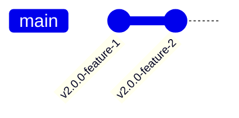
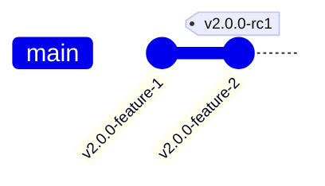
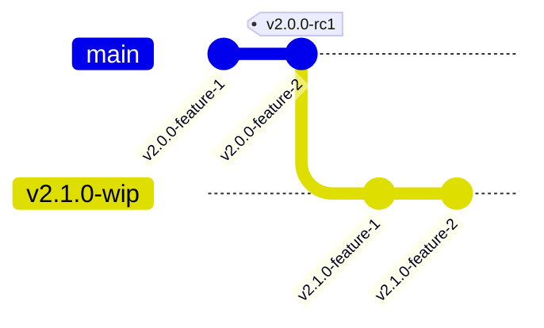
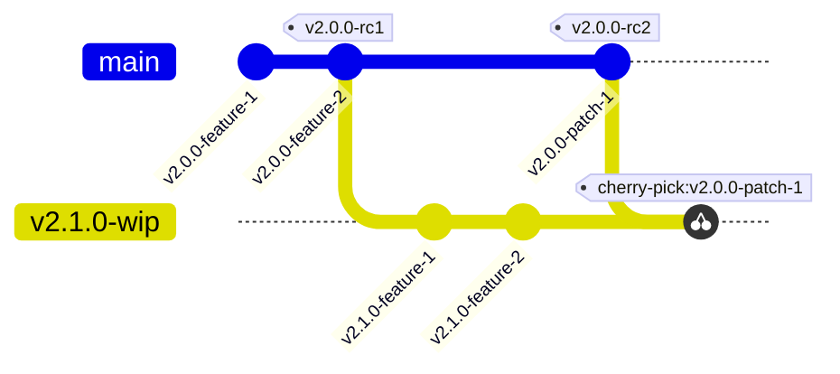
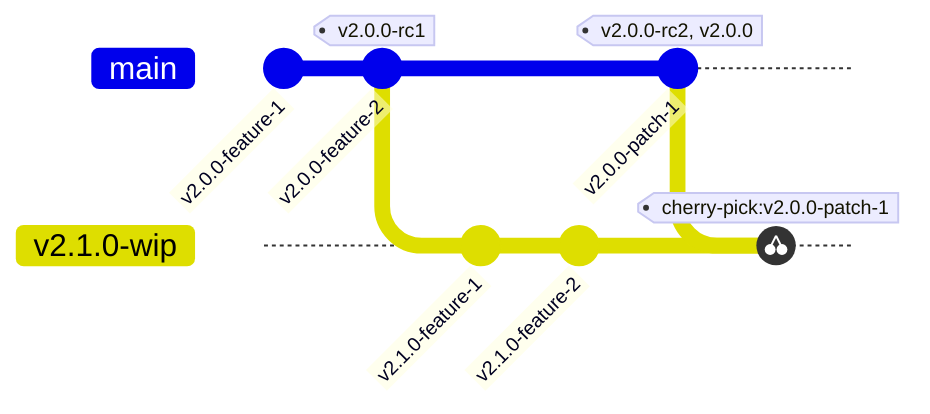
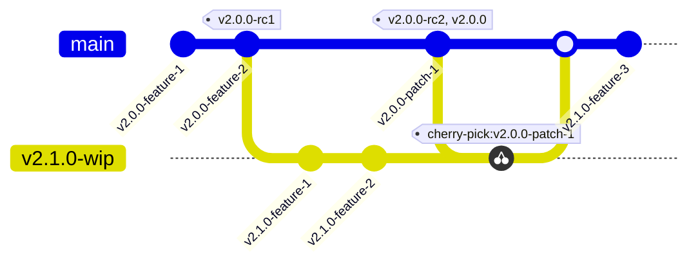
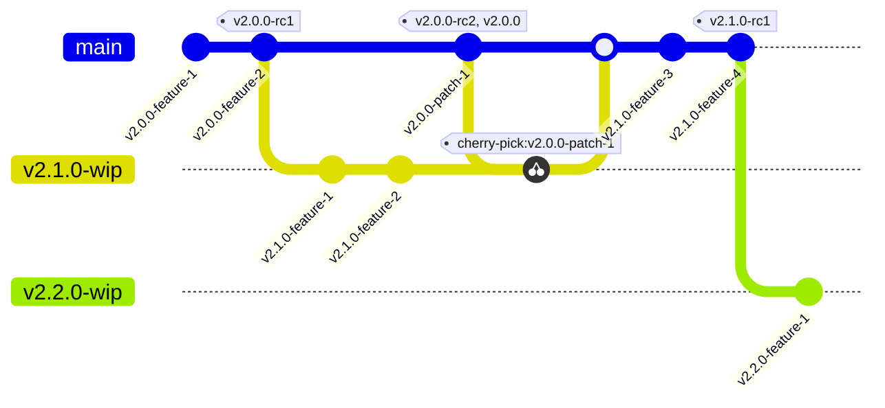

# Branching strategy

We follow the patterns and conventions in [GitHub Flow](https://docs.github.com/en/get-started/using-github/github-flow).

- Try to only put related changes into a single PR and keep them as small and as focused
  as is reasonable.
  - If you start shaving yaks consider putting these changes into
    a separate PR.
- Likewise, if you find the change you're making is quite large, you can spread it across
  multiple PRs
  - Even if functionality is only partly
    complete any one of them.
- Include a link to the Jira card in a relevant commit message and in the PR
  description.

Below is a visual representation of the branching strategy. For concreteness lets consider
the next version being developed for release v2.0.0:

Outside a release cycle, features get merged into main:

Once a release is ready for testing we tag it as a release candidate, e.g. v2.0.0-rc1, to be tested in the test and qa environments:

Any new work for the next version, v2.1.0 in this case, goes onto a work in progress (wip) branch:

Any patches to the release candidate are applied to both main and the wip branch,
and the commit on main gets tagged as the next release candidate:

Once the release candidate has been confirmed good and release approvals have been given,
it is tagged as the new version (`v2.0.0`), and deployed to production:

At this point the wip branch can be merged into main and feature development for v2.1.0
can continue on main branch:

Once the first release candidate for v.2.1.0 is ready, the process repeats:

