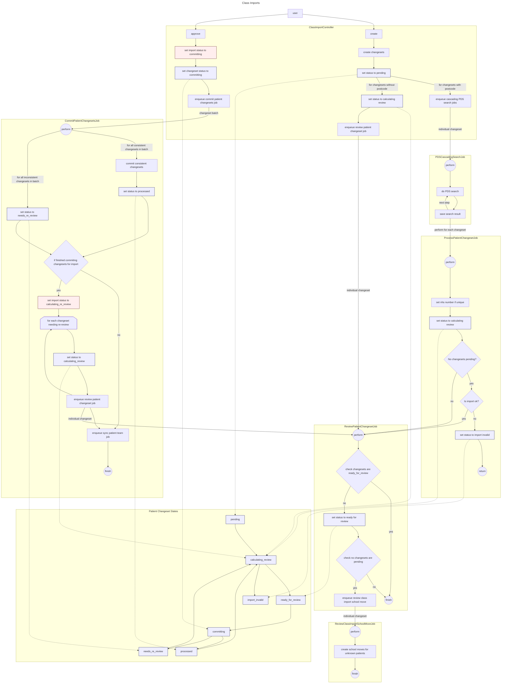

# Patient Import Flow Chart

This is the flow chart for patient imports are performed, including the new review phases.

```mermaid
---
title: Class Imports
---
flowchart TB

	classDef status_change stroke:#004,fill:#eef
	classDef import_status_change stroke:#400,fill:#fee

	subgraph "Patient Changeset States"
		direction TB

		changeset_statuses_pending[pending]:::status_change
		changeset_statuses_calculating_review[calculating_review]:::status_change
		changeset_statuses_ready_for_review[ready_for_review]:::status_change
		changeset_statuses_committing[committing]:::status_change
		changeset_statuses_needs_re_review[needs_re_review]:::status_change
		changeset_statuses_processed[processed]:::status_change
		changeset_statuses_import_invalid[import_invalid]:::status_change

		changeset_statuses_pending --> changeset_statuses_calculating_review
		changeset_statuses_calculating_review --> changeset_statuses_ready_for_review
		changeset_statuses_calculating_review --> changeset_statuses_import_invalid
		changeset_statuses_ready_for_review --> changeset_statuses_committing
		changeset_statuses_committing --> changeset_statuses_processed
		changeset_statuses_committing --> changeset_statuses_needs_re_review
		changeset_statuses_needs_re_review --> changeset_statuses_calculating_review
		changeset_statuses_processed --> changeset_statuses_calculating_review
	end

    user --> create
    user --> approve

    subgraph ClassImportController
	    set_status_to_pending:::status_change
	    create_changesets["create changesets"]
        set_status_to_pending["set status to pending"]
        enqueue_pds_cascading_search_jobs["enqueue cascading PDS search jobs"]
        set_import_status_to_committing["set import status to committing"]:::import_status_change
        set_changeset_status_to_committing["set changeset status to committing"]:::status_change
        enqueue_commit_patient_changesets_job["enqueue commit patient changesets job"]
        class_import_controller_set_status_to_calculating_review["set status to calculating review"]:::status_change
        class_import_controller_enqueue_review_patient_changeset_job["enqueue review patient changeset job"]

        create --> create_changesets
        create_changesets --> set_status_to_pending
        set_status_to_pending --"for changesets with postcode"--> enqueue_pds_cascading_search_jobs
        set_status_to_pending --"for changesets without postcode"--> class_import_controller_set_status_to_calculating_review
        class_import_controller_set_status_to_calculating_review -...-> changeset_statuses_calculating_review
        class_import_controller_set_status_to_calculating_review --> class_import_controller_enqueue_review_patient_changeset_job
        set_status_to_pending -...-> changeset_statuses_pending

        approve --> set_import_status_to_committing
	    set_import_status_to_committing --> set_changeset_status_to_committing:::status_change
	    set_changeset_status_to_committing --> enqueue_commit_patient_changesets_job
	    set_changeset_status_to_committing -...-> changeset_statuses_committing
    end
    enqueue_pds_cascading_search_jobs -- "individual changeset" --> start_pds_cascading_search
	enqueue_commit_patient_changesets_job -- "changeset batch" --> start_commit_patient_changesets
	class_import_controller_enqueue_review_patient_changeset_job --"individual changeset"--> start_review_patient_changeset

    subgraph PDSCascadingSearchJob
	    start_pds_cascading_search((perform))
	    do_pds_search["do PDS search"]
	    save_search_result["save search result"]
        start_pds_cascading_search --> do_pds_search
        do_pds_search --> save_search_result
        save_search_result -- "next step" --> do_pds_search
    end
    save_search_result -- "perform for each changeset" --> start_process_patient_changeset

    subgraph ProcessPatientChangesetJob
        start_process_patient_changeset((perform))
	    check_no_changesets_pending{No changesets pending?}
	    check_import{Is import ok?}
	    set_status_to_calculating_review["set status to calculating review"]:::status_change
	    set_nhs_number_if_unique["set nhs number if unique"]
	    set_status_to_import_invalid["set status to import invalid"]:::status_change

	    start_process_patient_changeset --> set_nhs_number_if_unique
	    set_nhs_number_if_unique --> set_status_to_calculating_review
	    set_status_to_calculating_review --> check_no_changesets_pending
	    set_status_to_calculating_review -..-> changeset_statuses_calculating_review
	    check_no_changesets_pending -- yes --> check_import
	    check_import -- no --> set_status_to_import_invalid
	    set_status_to_import_invalid --> return
	    set_status_to_import_invalid -..-> changeset_statuses_import_invalid
	    return((return))
	end
    check_no_changesets_pending -- no --> start_review_patient_changeset
	check_import -- yes --> start_review_patient_changeset

    subgraph ReviewPatientChangesetJob
	    start_review_patient_changeset((perform))
	    check_ready_for_review{check changesets are ready_for_review}
	    check_none_pending{check no changesets are pending}
	    set_status_to_ready_for_review["set status to ready for review"]:::status_change
        enqueue_review_class_import_school_move["enqueue review class import school move"]

	    start_review_patient_changeset --> check_ready_for_review
	    check_ready_for_review -- yes --> finish_review_patient_changeset_job((finish))
	    check_ready_for_review -- no --> set_status_to_ready_for_review
	    set_status_to_ready_for_review --> check_none_pending
	    set_status_to_ready_for_review -..-> changeset_statuses_ready_for_review
	    check_none_pending -- no --> finish_review_patient_changeset_job
	    check_none_pending -- yes --> enqueue_review_class_import_school_move
    end

	subgraph ReviewClassImportSchoolMoveJob
		start_review_class_import_school_move((perform))
	    create_school_moves_for_unknown_patients["create school moves for unknown patients"]

		start_review_class_import_school_move --> create_school_moves_for_unknown_patients
		create_school_moves_for_unknown_patients --> finish((finish))
	end
	enqueue_review_class_import_school_move -- "individual changeset" --> start_review_class_import_school_move

	subgraph CommitPatientChangesetsJob
		start_commit_patient_changesets((perform))
		set_status_to_processed["set status to processed"]:::status_change
		if_finished_commiting_changesets{if finished commiting changesets for import}
		set_status_to_calculating_review_2[set status to calculating review]:::status_change
        commit_consistent_changesets["commit consistent changesets"]
        set_status_to_calculating_review_2["set status to calculating_review"]
        enqueue_review_patient_changeset_job["enqueue review patient changeset job"]
        set_import_status_to_calculating_re_review["set import status to calculating_re_review"]
        enqueue_sync_patient_team_job["enqueue sync patient team job"]
        commit_patient_changeset_job_finish((finish))
        set_status_to_needs_re_review[set status to needs_re_review]:::status_change
        for_each_changeset_needing_re_review@{ shape: notch-pent, label: "for each changeset needing re-review" }

		start_commit_patient_changesets -- "for all consistent changesets in batch" --> commit_consistent_changesets
		start_commit_patient_changesets -- "for all inconsistent changesets in batch" --> set_status_to_needs_re_review
		set_status_to_needs_re_review -..-> changeset_statuses_needs_re_review
		commit_consistent_changesets --> set_status_to_processed
		set_status_to_processed ---> if_finished_commiting_changesets
		set_status_to_needs_re_review --> if_finished_commiting_changesets
		set_status_to_processed -..-> changeset_statuses_processed
		if_finished_commiting_changesets -- no --> enqueue_sync_patient_team_job
		if_finished_commiting_changesets -- yes --> set_import_status_to_calculating_re_review:::import_status_change
		set_import_status_to_calculating_re_review --> for_each_changeset_needing_re_review
		for_each_changeset_needing_re_review --> set_status_to_calculating_review_2
		enqueue_review_patient_changeset_job --> for_each_changeset_needing_re_review
		set_status_to_calculating_review_2 --> enqueue_review_patient_changeset_job
		set_status_to_calculating_review_2 -..-> changeset_statuses_calculating_review
		enqueue_review_patient_changeset_job --> enqueue_sync_patient_team_job
		enqueue_sync_patient_team_job --> commit_patient_changeset_job_finish
	end
	enqueue_review_patient_changeset_job --"individual changeset"--> start_review_patient_changeset

```
