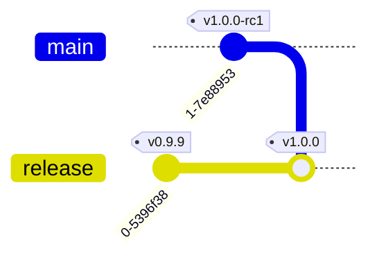

# Releasing

Our default branch for making changes is `next`: new features and non-urgent
bug fixes should be merged into here.

The `release` branch is a reference to what is in production at any point in
time. It usually tracks `main` but can also point to hotfix branches as
necessary.

Releasing basically follows these steps:

1. Merge `next` into `main`
2. Create a draft release by running the `Draft new release` workflow. This will
   create a tag (e.g. `v1.0.0`) on `main` and create a draft release in GitHub with initial release notes.
3. Update the release notes, add information about the changes.
4. Update the assurance statement.
5. Fast-forward or reset `release` to the release tag
6. Run the `Deploy` workflow to deploy to production.
7. Publish the release in GitHub.



Details below.

## Pre-release and testing

Changes merged into `next` are deployed to the `qa` and `test` environments for
testing. When there is a large batch of PRs to merge at once, after a
merge-freeze for example, only merge a few at a time to try to make it easier to
trace any issues that arise during testing.

## Release candidate

Once all the necessary changes are merged and have been tested, merge `next` into `main` and create a new draft release.

At this point the changes in the release will go through the NHS assurance
processes, and possibly through external testing and assurance. If required it
can be deployed to the `preview` or `training` environments.

## Deploy to production

When we are ready to release, update the `release` branch and deploy it to
production. If there have been no hot-fixes since the last release then this is
a simple fast-forward merge that has to be done on your localhost (see below for
how to manage non-fast-forwardable situations):

```shell
git checkout release
git pull origin release

# Check that release can be fast-forwarded to the release candidate
git merge-base --is-ancestor release v1.0.0-rc1 && echo "safe to ff-merge"
# If release has diverged from main and cannot be fast-forwarded to the release
# candidate, see the instructions below

git merge --ff-only v1.0.0-rc1
git push --tags origin release
```

Once the `release` branch is updated on GitHub, it's time to deploy. Start with a deploy to `training` or
`preview` to ensure the tagged version is correct. Once that's done you can
deploy to production.

Use the `deploy.yml` workflow to run the deployments. For the production deployment, it's important to start the workflow from the `main` branch and specify the tag to deploy as input. This is because only workflows from the `main` branch can authenticate with the production AWS account.

Changes to the backup infrastructure must be deployed separately. In the rare case that the backup infrastructure needs to be updated, run the `deploy-backup-infrastructure.yml` workflow.

## When `release` and `main` have diverged

There are cases when `release` won't be fast-forwardable to the release
candidate on `main`. This will happen when a fix has been applied to the
`release` branch that circumvented the normal release cycle (AKA hot-fix, see
below).

In these cases the `release` branch will need to be reset to the latest release
candidate.

```sh
git checkout release
git pull origin release
git reset --hard v1.0.0-rc1
git push --tags origin release
```

And then you can follow the instructions above about creating the release tag
and deploying.

## Hot-fixes

Hot-fixes are emergency fixes made to the current release that bypass changes
that are in `main`. These fixes should still go through the pull-request
process, but to a version-specific branch, e.g. `v1.0.1-hotfixes`. Once these
are merged in, the commits will need to be applied to `main`, e.g. via
cherry-picking, and `release` should be fast-forwarded/reset to the latest code
released.


At this point the histories of the `release` and `main` branches will have
diverged and it will not be possible to fast-forward the `release` branch when
releasing. It will have to be reset to the latest release candidate as
previously described.

## Rollback

A release can be rolled back by deploying the previous release tag using the regular GitHub workflow. This can be done on a per-service level or for all services.
If the issue is spotted early and the CodeDeploy deployment is still in progress, the new deployment can still be aborted.
To do this, go to the CodeDeploy console, select the deployment group, and click "Stop deployment".
