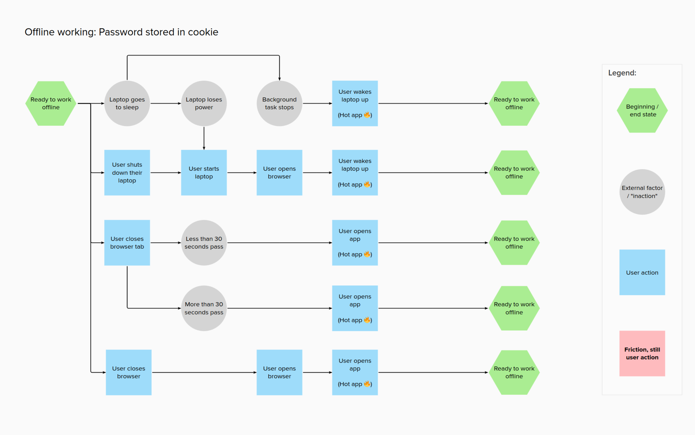

# Securely storing offline data in browsers

## The need for secure offline storage

Our application allows School Age Immunisation Services (SAIS) nurses to run vaccination programmes in schools. The nurses do not always have access to internet in these schools.

As such, our application needs offline capabilities, and the offline data needs to be stored securely.

## The options for offline storage

These are the main places where browsers store website data:

| Store name       | How to access it                                                                                                                        | Is it stored securely        | Caveats                                                        |
| ---------------- | --------------------------------------------------------------------------------------------------------------------------------------- | ---------------------------- | -------------------------------------------------------------- |
| Navigation cache | Browsers automatically save pages into the navigation cache as a user navigates. When you use the back button, you're using this cache. | No, plaintext on disk        | Can be disabled by setting a `Cache-Control: no-store` header. |
| Cookies          | Can be written to by servers, or client-side JS, with various flags to restrict access.                                                 | Almost... more on this later | Small size limit, potentially sent on every request            |
| WebStorage API   | LocalStorage and SessionStorage, trivially using client-side JS                                                                         | No, plaintext on disk        | SessionStorage is probably in-memory, but ephemeral            |
| IndexedDB        | Written to by our JS code using IndexedDB API, or a wrapper like `idb`; it's pretty much a full database                                | No, plaintext on disk        |                                                                |
| Cache API        | Cache API, widely used for creating offline proxies using ServiceWorkers, in libraries such as Workbox                                  | No, plaintext on disk        |                                                                |

The **navigation cache** is populated automatically when a user navigates. We
need to disable it using the `Cache-Control` header so that we don't
accidentally save pages with patient data to disk in plaintext.

**Cookies** are stored securely (sometimes... discussed later), but have a size
limit that prevents their use for larger blobs of data.

**WebStorage** is plaintext and can't be accessed from a ServiceWorker, so they
wouldn't work as storage in an offline-capable app.

**Cache API** is also plaintext and only suitable for storing `Request` type
objects, while we'd also store other things, such as vaccination data that
hasn't been uploaded yet, that wouldn't fit that mold.

The main suitable store is **IndexedDB**, but we need to enhance it with
encryption to make it viable.

To highlight why plaintext offline storage isn't appropriate, let's highlight
what threats we're modelling for.

## Threat vectors for offline data

Any sensitive data that's pushed into IndexedDB, or the other APIs, will show
up when running a `grep -R "sensitive-data"` from a user's home folder.

Here is an example using LocalStorage:

```bash
$ grep -iR "sensitive-data" ./.config/BraveSoftware/
$ # No matches
$ # Now open Brave, execute `localStorage.setItem("secret", "sensitive-data");`
$ grep -iR "sensitive-data" ./.config/BraveSoftware/
grep: ./.config/BraveSoftware/Brave-Browser/Default/Local Storage/leveldb/000012.log: binary file matches
```

The database is a binary file, but the string is there, and can be trivially
extracted with `STRINGS(1)`.

Fundamentally, using those storage backends as-is can be thought of like having
a CSV of patient data in your downloads folder. A few potential threats to that
are:

1. If your laptop isn't encrypted, someone that gains physical access can read
   the content of your home folder and extract the data. This can happen if a
   user has their laptop stolen
2. A piece of malware running without root can exfiltrate all data it finds in
   the home folder. This can happen if a user downloads and runs a malicious
   program, but given that it doesn't require root, it's a very low barrier

As such, storing offline data in plaintext is a no-go. One possible solution is
to encrypt it.

## Encrypting offline data

Using the [SubtleCrypto
API](https://developer.mozilla.org/en-US/docs/Web/API/SubtleCrypto), we have
access to fast and secure key derivation, hashing, and encryption methods.

We're deriving a key using PBKDF2, salting it, and then using it to encrypt
data using AES-GCM and SHA-256.

We can use this with an IndexedDB wrapper that encrypts/decrypts data on the
fly as it's written and read.

This mitigates both threats mentioned in the previous section:

1. Someone that obtains physical access to a device, even with unencrypted
   storage, won't be able to get to the patient data. They'd now have to (at
   the minimum) log in as the user, which requires knowing their password
2. A piece of malware running without root will only find encrypted data, as
   now the only place that decrypted data exists is in the browser memory,
   which is protected by OS sandboxing features

With one caveat. To encrypt and decrypt something, the ServiceWorker needs a
passphrase or key.

We can generate one on the server, or the client, but where do we store it?
We're back to the first issue: that browsers do not have a secure store that's
accessible from client-side JavaScript.

### Detour: The secure storage proposal

Applications such as password manager extensions (1Password, LastPass), or
crypto wallets (MetaMask) have similar encryption requirements, and the
1Password organisation has submitted a [W3C WebExtension proposal for
`browser.secureStorage`](https://github.com/w3c/webextensions/blob/main/proposals/secure-storage.md).

This is an API that allows access to the platform-specific sensitive data
store, most commonly a keychain, trusted platform module, and commonly
protected by requiring root access or biometrics.

This is an ideal solution, but there is no way to know if this proposal will
ever ship.

So today, we have to rely on other means of storing the main encryption key.
We've considered two options.

### Option 1: Store the passphrase with the user

The first option we explored is one in which we ask the user for a password, or
generate one on their behalf and ask them to store it. We keep this password in
memory for as long as we can.

When the password is cleared from memory, we have to prompt the user to
re-enter it. Here is a flowchart of the various scenarios where the user would
have to enter a password:


The exact design for generating the password and prompting the user is still
being explored, to strike a balance between security concerns and ease of
remembering or safe storage. We consider it a best-case scenario if the user
has a password manager set up, and stores their password in that, but we can't
assume this to be the case.

One design we're currently exploring:


The main downside to this approach is that it relies on users to constantly
type in passwords, store them securely, and recall and remember them. This is a
big detriment to the overall user experience.

It also introduces possible edge cases where users work offline, but then
forget the password, and would need help recovering it to be able to sync their
work.

### Option 2: Store the passphrase in a cookie

The second option is to generate a password on the user's behalf and then store
it in a cookie. The cookie can be set up with an appropriate configuration:

- A `path` that isn't used, so it's never sent to the server unintentionally
- The `secure` flag and `samesite=strict`
- An expiry of our choice

This would make it always accessible from client-side JS, and the flowchart
would now look like this:



Effectively, storing it in the cookie saves the user from ever having to type
the decryption passphrase in, as we can just get it programatically. It's a
great improvement to the overall user experience.

The downsides are:

1. So long as the device is unlocked, an attacker will be able to access the
   patient data.
2. ... Cookies are stored securely only some of the time.

Let's detour to talk about cookie security.

#### Detour: Why cookies are stored almost securely, and not always

This is a section that will not age well. Browsers and operating systems are a
moving target, and they can and do iterate their security.

As of May 2023, our investigation into cookie security has revealed that while
some browsers store cookies securely by encrypting them at rest and storing a
passphrase in the OS keychain, this isn't universally true, and for Windows at
least, the security appears to be trivial to break.

Of the combinations we investigated and tested:

- Chrome on MacOS: Secure. [Encrypted cookies, Keychain
  used](https://github.com/zellyn/kooky/blob/3e66d684c4db57a3230a6ed65956f2571432c4c5/internal/chrome/chrome_darwin.go#L13)
- Chrome on Windows: **Insecure.** [Encrypted cookies, Keychain used, but...](https://github.com/zellyn/kooky/blob/3e66d684c4db57a3230a6ed65956f2571432c4c5/internal/chrome/chrome_windows.go#L64)
  - ... since Chrome 80, [the Local Machine scope is used to hide the master
    key](https://security.stackexchange.com/questions/230137/did-changes-in-google-chrome-80-weaken-cookie-and-password-encryption),
    which means any Windows user can access it, privileged or not
  - And even if this wasn't the case, and it required root privileges, those
    are governed by UAC which is [commonly
    bypassed](https://community.ibm.com/community/user/security/blogs/nigel-sood/2022/04/27/diving-into-windows-uac-bypasses)
    and [has a checkered past of being acknowledged by Microsoft as a valid
    security
    vulnerability](https://security.stackexchange.com/questions/189491/microsoft-said-uac-is-not-a-security-barrier-but-in-what-cases)
- Chrome on Linux: Secure. [Encrypted cookies, GNOME keyring
  used](https://github.com/zellyn/kooky/blob/3e66d684c4db57a3230a6ed65956f2571432c4c5/internal/chrome/chrome_linux.go#L23) [^1]
- Firefox on Everything: **Insecure.** [Cookies stored in
  plaintext](https://github.com/zellyn/kooky/blob/3e66d684c4db57a3230a6ed65956f2571432c4c5/internal/firefox/firefox.go#L16)

Statistically our users are most likely to use a Chrome-based browser on
Windows, which would mean a high likelihood of cookies being accessible to an
attacker through [easily accessible
software](https://www.nirsoft.net/utils/chrome_cookies_view.html).

## Going native

There is a third option which involves accessing a native OS keychain.

Possibilities include:

- Creating an Electron (or similar) desktop webview application which wraps the main
  website and provides access to the OS keychain
  - This could be done later as a [progressive
    enhancement](https://en.wikipedia.org/wiki/Progressive_enhancement), where
    the application can detect if it's running inside our webview and upgrade
    to a user journey that keeps the encryption key in the keychain
- Creating a companion mobile app with the explicit purpose of storing the key

These could be explored at a later stage, as a progressive enhancement. It's
possible that our users won't have admin rights to install applications on
their devices.

[^1]: This didn't use to be the case, and back in v10, cookies on Chrome for Linux were [protected by the password "peanuts" and the salt "saltysalt"](https://www.reddit.com/r/netsec/comments/39swuj/key_for_chromiums_encrypted_cookies_store_in/)
