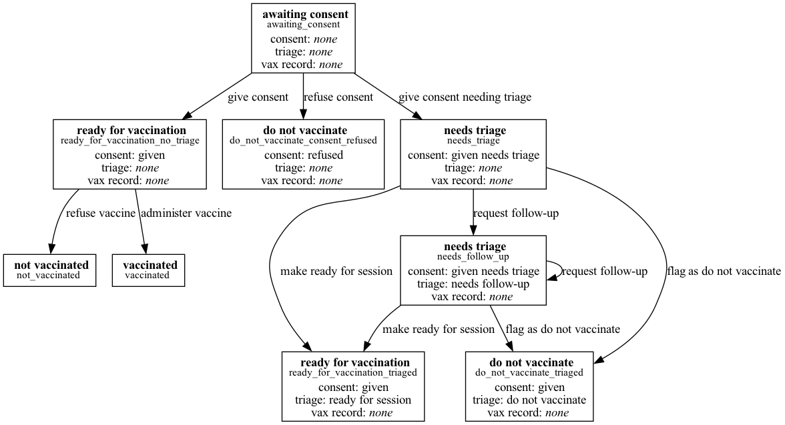

# Patient states

| Consent            | Triage            | Vaccination Record | State                 | Actions                                                             |
| ------------------ | ----------------- | ------------------ | --------------------- | ------------------------------------------------------------------- |
| none               | none              | none               | awaiting consent      | give consent, give consent needing triage, refuse consent           |
| given              | none              | none               | ready for vaccination | administer vaccine, refuse vaccine                                  |
| refused            | none              | none               | do not vaccinate      |                                                                     |
| given needs triage | none              | none               | needs triage          | make ready for session, request follow-up, flag as do not vaccinate |
| given needs triage | ready for session | none               | ready for vaccination | administer vaccine, refuse vaccine                                  |
| given needs triage | needs follow-up   | none               | needs follow-up       | make ready for session, request follow-up, flag as do not vaccinate |
| given needs triage | do not vaccinate  | none               | do not vaccinate      |                                                                     |
| \*                 | \*                | administered       | vaccinated            |                                                                     |
| \*                 | \*                | not administered   | not vaccinated        |                                                                     |

