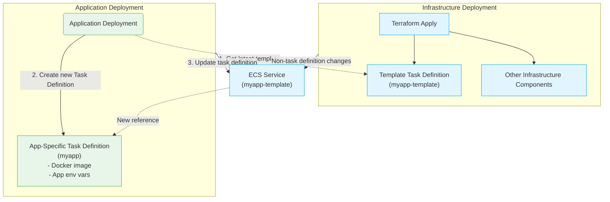
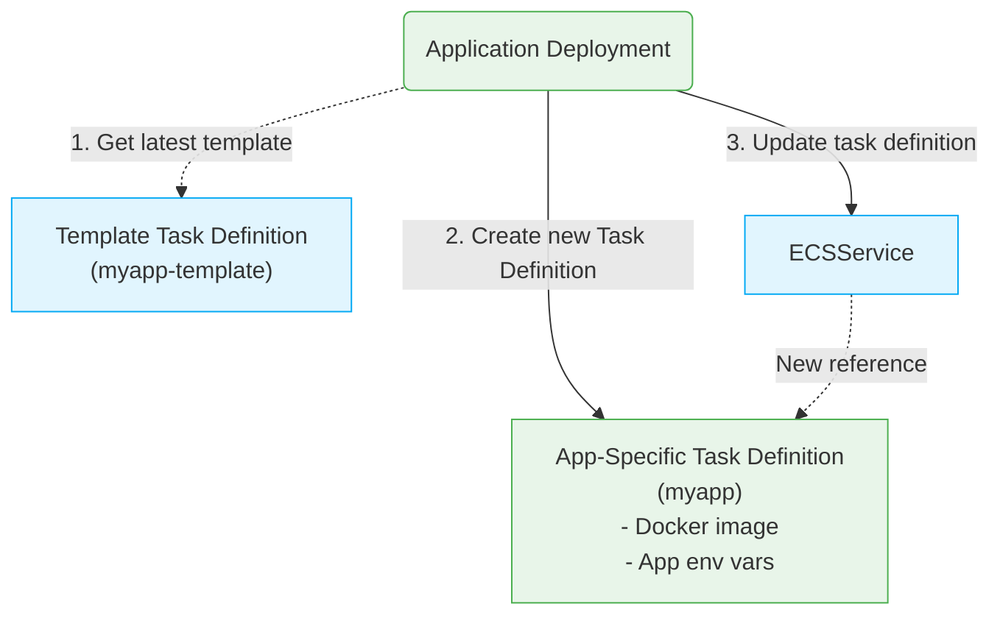
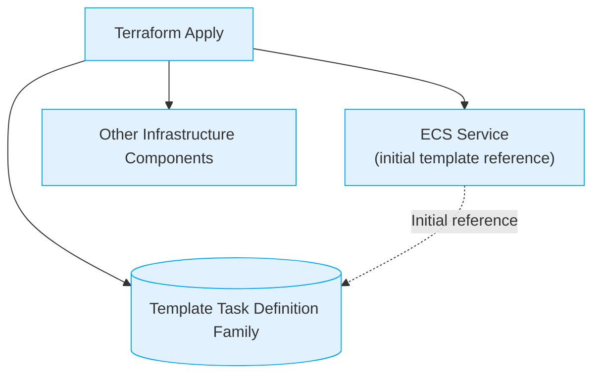

# Deployment Process

To ensure minimal dependency between application and infrastructure deployments a few key choices have
been made. Notably, the ECS services are initially wired to a "template" task definition family that is managed by
Terraform, but which contains no application-specific details. During normal application deployments, a new task
definition is created based on the latest version of the "template" family, but including the docker image and other
non-infrastructure related environment variables (like app version). In this setup any application deployment can
proceed without affecting any resources tracked by Terraform, and infrastructure deployments can be done
without requiring any application deployments.

# Deployment illustrations:

As can be well illustrated in the below diagrams there is now a dependency of application deployment on infrastructure
components (ECS Service, Task definition template, etc.) but not vice versa. This allows for independent deployment cycles
for infrastructure and application changes.

## Generic deployments

## Application deployment:

## Infrastructure deployment:

