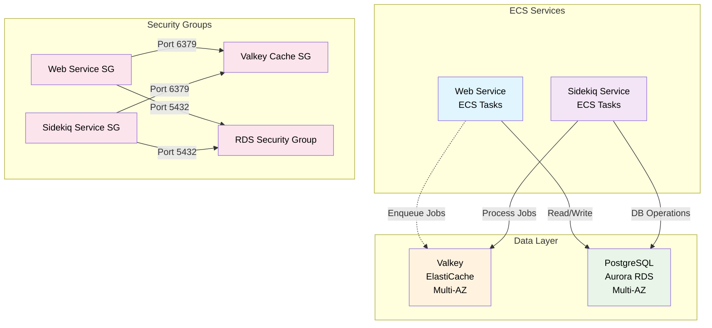

# Valkey Serverless and Sidekiq Setup

This document describes the Valkey Serverless ElastiCache setup for background job processing with Sidekiq.

## Overview

The infrastructure includes:

- **ElastiCache Serverless** running Valkey (Redis-compatible)
- **Security Groups** with appropriate access controls
- **CloudWatch Logging** for monitoring
- **ECS Service** running Sidekiq workers

## Architecture

(Not clear whether the web service will have direct access to the valkey instance yet)

## Components

### 1. ElastiCache Serverless Valkey

**Resource**: `aws_elasticache_serverless_cache.valkey_serverless`

- **Engine**: Valkey (Redis-compatible)
- **Instance type** Self managed instance (serverless only possible in cluster mode which is not supported by sidekiq)

### 2. Security Groups

**Valkey Security Group**: `aws_security_group.valkey_security_group`

- Allows inbound traffic on port 6379 from all ECS service groups
- No outbound rules (default deny)

### 3. Subnet Group

**ElastiCache Subnet Group**: `aws_elasticache_subnet_group.valkey_subnet_group`

- Spans private subnets in both availability zones
- Ensures high availability and fault tolerance

### 4. Parameter Group

**Valkey Parameter Group**: `aws_elasticache_parameter_group.valkey_params`

- Family: `valkey8`
- Optimized for Sidekiq workloads:
  - `maxmemory-policy`: `noeviction`

### 5. CloudWatch Logging

**Log Groups**:

- `/aws/elasticache/valkey/{environment}/slow-log`
- `/aws/elasticache/valkey/{environment}/engine-log`
- Retention: 14 days (configurable)

## Configuration Variables

### Required Variables

| Variable      | Type   | Default | Description                             |
| ------------- | ------ | ------- | --------------------------------------- |
| `environment` | string | -       | Environment name (e.g., production, qa) |

### Optional Variables

| Variable                            | Type   | Default                 | Description                        |
| ----------------------------------- | ------ | ----------------------- | ---------------------------------- |
| `valkey_engine_version`             | string | `"8.0"`                 | Valkey engine version              |
| `valkey_node_type`                  | string | `"cache.r7g.large"`     | ElastiCache node type              |
| `valkey_snapshot_retention_limit`   | number | `7`                     | Snapshot retention days            |
| `valkey_snapshot_window`            | string | `"03:00-05:00"`         | Daily snapshot window (UTC)        |
| `valkey_maintenance_window`         | string | `"sun:05:00-sun:06:00"` | Weekly maintenance window (UTC)    |
| `valkey_transit_encryption_enabled` | bool   | `true`                  | Enable encryption in transit       |
| `valkey_auth_token_enabled`         | bool   | `false`                 | Enable auth token                  |
| `valkey_log_retention_days`         | number | `14`                    | Log retention days                 |
| `sidekiq_replicas`                  | number | `2`                     | Number of Sidekiq service replicas |

## Environment Variables

The following environment variables are automatically configured for ECS tasks:

- `REDIS_URL`: Primary connection URL for Valkey cluster (This is currently not set as it is not yet clear whether the
  web service needs access to the Redis instace)
- `SIDEKIQ_REDIS_URL`: Sidekiq-specific connection URL
