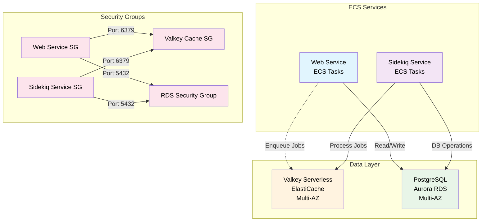

# Valkey Serverless and Sidekiq Setup

This document describes the Valkey Serverless ElastiCache setup for background job processing with Sidekiq.

## Overview

The infrastructure includes:

- **ElastiCache Serverless** running Valkey (Redis-compatible)
- **Security Groups** with appropriate access controls
- **CloudWatch Logging** for monitoring
- **ECS Service** running Sidekiq workers

## Architecture


```mermaid
graph TB
    subgraph "ECS Services"
        WEB[Web Service<br/>ECS Tasks]
        SIDEKIQ[Sidekiq Service<br/>ECS Tasks]
    end

    subgraph "Data Layer"
        VALKEY[Valkey Serverless<br/>ElastiCache<br/>Multi-AZ]
        RDS[PostgreSQL<br/>Aurora RDS<br/>Multi-AZ]
    end

    subgraph "Security Groups"
        WEB_SG[Web Service SG]
        SIDEKIQ_SG[Sidekiq Service SG]
        VALKEY_SG[Valkey Cache SG]
        RDS_SG[RDS Security Group]
    end

    %% Job Queue Flow
    WEB -.->|Enqueue Jobs| VALKEY
    SIDEKIQ -->|Process Jobs| VALKEY

    %% Database Operations
    WEB -->|Read/Write| RDS
    SIDEKIQ -->|DB Operations| RDS

    %% Security Group Rules
    WEB_SG -->|Port 6379| VALKEY_SG
    SIDEKIQ_SG -->|Port 6379| VALKEY_SG
    WEB_SG -->|Port 5432| RDS_SG
    SIDEKIQ_SG -->|Port 5432| RDS_SG

    classDef webService fill:#e1f5fe,color:#000000
    classDef sidekiqService fill:#f3e5f5,color:#000000
    classDef valkeyService fill:#fff3e0,color:#000000
    classDef dbService fill:#e8f5e8,color:#000000
    classDef securityGroup fill:#fce4ec,color:#000000

    class WEB webService
    class SIDEKIQ sidekiqService
    class VALKEY valkeyService
    class RDS dbService
    class WEB_SG,SIDEKIQ_SG,VALKEY_SG,RDS_SG securityGroup
```

## Components

### 1. ElastiCache Serverless Valkey

**Resource**: `aws_elasticache_serverless_cache.valkey_serverless`

- **Engine**: Valkey (Redis-compatible)
- **Scaling**: Automatic scaling based on demand
- **Storage**: Configurable maximum (default 5GB)
- **Compute**: Configurable ECPU per second (default 5000)
- **Encryption**: Built-in encryption at rest and in transit
- **Backup**: Configurable snapshot retention
- **Maintenance**: Fully managed by AWS

### 2. Security Groups

**Valkey Security Group**: `aws_security_group.valkey_security_group`

- Allows inbound traffic on port 6379 from private subnets (10.0.2.0/24, 10.0.3.0/24)
- No outbound rules (default deny)

**ECS Services**: Use existing security groups with egress-all rules

### 3. Subnet Group

**ElastiCache Subnet Group**: `aws_elasticache_subnet_group.valkey_subnet_group`

- Spans private subnets in both availability zones
- Ensures high availability and fault tolerance

### 4. Parameter Group

**Valkey Parameter Group**: `aws_elasticache_parameter_group.valkey_params`

- Family: `valkey7`
- Optimized for Sidekiq workloads:
  - `maxmemory-policy`: `allkeys-lru`
  - `timeout`: `300`

### 5. CloudWatch Logging

**Log Groups**:

- `/aws/elasticache/valkey/{environment}/slow-log`
- `/aws/elasticache/valkey/{environment}/engine-log`
- Retention: 7 days (configurable)

## Configuration Variables

### Required Variables

| Variable      | Type   | Default | Description                             |
| ------------- | ------ | ------- | --------------------------------------- |
| `environment` | string | -       | Environment name (e.g., production, qa) |

### Optional Variables

| Variable                            | Type   | Default                 | Description                        |
| ----------------------------------- | ------ | ----------------------- | ---------------------------------- |
| `valkey_engine_version`             | string | `"7.2"`                 | Valkey engine version              |
| `valkey_node_type`                  | string | `"cache.t3.micro"`      | ElastiCache node type              |
| `valkey_num_cache_nodes`            | number | `2`                     | Number of cache nodes              |
| `valkey_snapshot_retention_limit`   | number | `5`                     | Snapshot retention days            |
| `valkey_snapshot_window`            | string | `"03:00-05:00"`         | Daily snapshot window (UTC)        |
| `valkey_maintenance_window`         | string | `"sun:05:00-sun:06:00"` | Weekly maintenance window (UTC)    |
| `valkey_transit_encryption_enabled` | bool   | `true`                  | Enable encryption in transit       |
| `valkey_auth_token_enabled`         | bool   | `false`                 | Enable auth token                  |
| `valkey_log_retention_days`         | number | `7`                     | Log retention days                 |
| `sidekiq_replicas`                  | number | `2`                     | Number of Sidekiq service replicas |

## Environment Variables

The following environment variables are automatically configured for ECS tasks:

- `REDIS_URL`: Primary connection URL for Valkey cluster
- `SIDEKIQ_REDIS_URL`: Sidekiq-specific connection URL

## Migration from Good Job

### Changes Made

1. **Replaced** `good_job_service` with `sidekiq_service`
2. **Added** Valkey ElastiCache cluster
3. **Updated** environment variables to include Redis connection details
4. **Modified** security groups for Valkey access
5. **Updated** health check command for Sidekiq

### Application Changes Required

Your application will need to:

1. **Install Sidekiq gem** and configure it to use Redis
2. **Update job classes** to use Sidekiq instead of Good Job
3. **Configure Sidekiq** to connect to the Valkey cluster
4. **Update deployment scripts** to handle the new service name

### Example Sidekiq Configuration

```ruby
# config/initializers/sidekiq.rb
Sidekiq.configure_server do |config|
  config.redis = { url: ENV["SIDEKIQ_REDIS_URL"] }
end

Sidekiq.configure_client do |config|
  config.redis = { url: ENV["SIDEKIQ_REDIS_URL"] }
end
```

## Monitoring and Troubleshooting

### CloudWatch Metrics

Monitor these key metrics:

- `CPUUtilization`
- `DatabaseMemoryUsagePercentage`
- `NetworkBytesIn/Out`
- `CurrConnections`

### Logs

Check these log groups:

- ECS task logs: `/aws/ecs/mavis-{environment}`
- Valkey slow logs: `/aws/elasticache/valkey/{environment}/slow-log`
- Valkey engine logs: `/aws/elasticache/valkey/{environment}/engine-log`

### Common Issues

1. **Connection timeouts**: Check security group rules
2. **Memory issues**: Monitor `DatabaseMemoryUsagePercentage`
3. **High CPU**: Consider scaling up node type
4. **Network issues**: Verify subnet group configuration

## Security Considerations

1. **Encryption**: Both at-rest and in-transit encryption are enabled
2. **Network isolation**: Valkey is only accessible from private subnets
3. **No public access**: Cluster is not accessible from the internet
4. **Auth tokens**: Disabled by default (can be enabled if needed)

## Cost Optimization

1. **Node sizing**: Start with `cache.t3.micro` and scale as needed
2. **Snapshot retention**: Adjust based on recovery requirements
3. **Multi-AZ**: Required for production, can be disabled for development
4. **Reserved instances**: Consider for production workloads

## Deployment Notes

1. **Dependencies**: Valkey cluster must be created before Sidekiq service
2. **Downtime**: Migration from Good Job to Sidekiq requires application changes
3. **Testing**: Verify Redis connectivity before deploying Sidekiq workers
4. **Rollback**: Keep Good Job configuration available for quick rollback if needed
