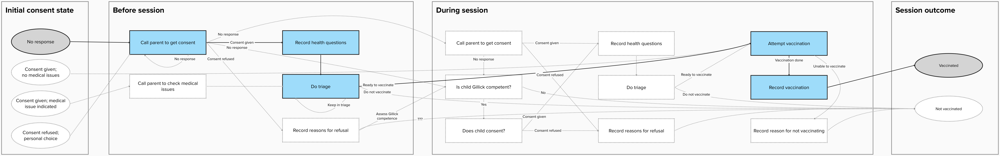

# End-to-end tests

We use playwright for end-to-end testing. This allows us to test features such
as offline service workers. These will also allow us to reuse these tests if the
application should need to be written in a different language/framework.

## Full journey tests

### Scenario: No initial consent, consent given before session, vaccination administered

[full_journey](full_journey.spec.ts)

