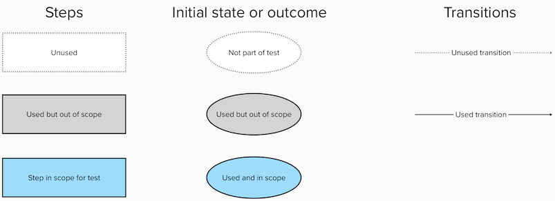
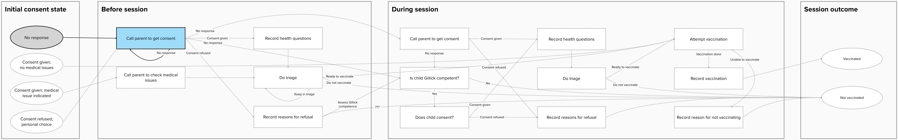
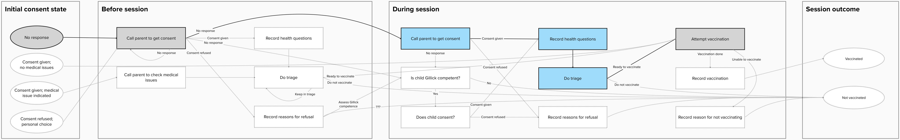
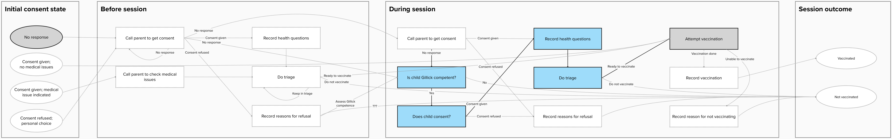
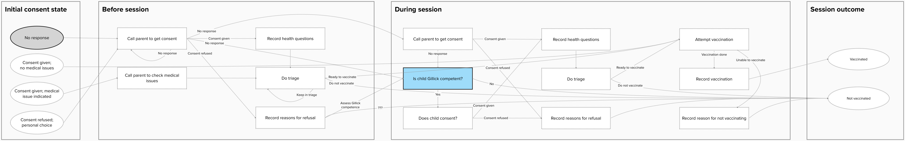
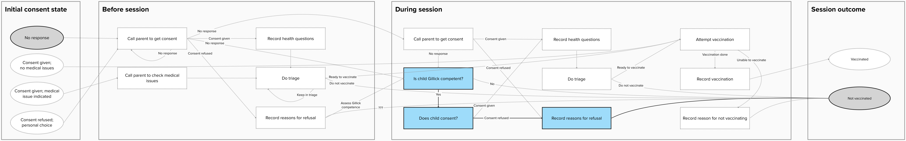
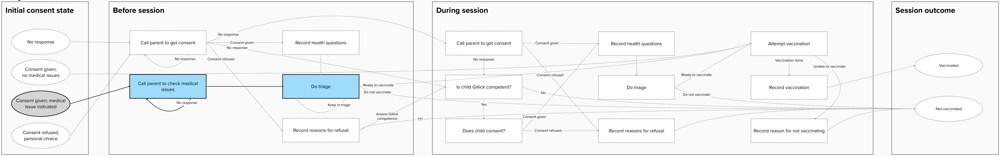
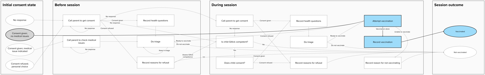
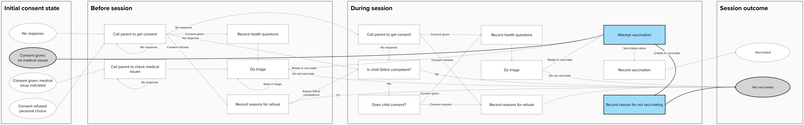
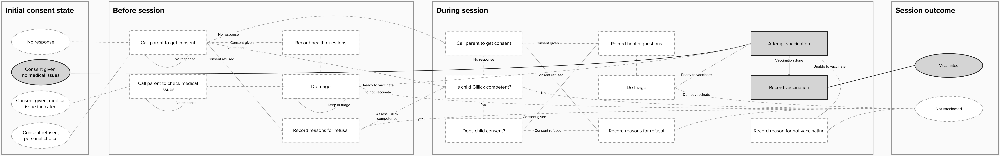

# End-to-end tests

We use playwright for end-to-end testing. This allows us to test features such
as offline service workers. These will also allow us to reuse these tests if the
application should need to be written in a different language/framework.

The diagrams below show what steps and transitions are used for each test.

## Full journey tests

### Scenario: No initial consent, consent given before session, vaccination administered

[Source file - full_journey.spec.ts](full_journey.spec.ts)

## Feature tests

### Feature: Consent - no response

[Source file - consent_no_response.spec.ts](consent_no_response.spec.ts)

Test of the flow when a nurse attempts to get consent during triage, but doesn't
get a response, followed by a successful attempt to get consent.

### Feature: Consent - parental consent obtained during vaccination

[Source file - consent_during_vaccination.spec.ts](consent_during_vaccination.spec.ts)

### Feature: Consent - Gillick competence assessment

[Source file - consent_gillick.spec.ts](consent_gillick.spec.ts)

### Feature: Consent - Gillick competence assessment passed but vaccination refused

[Source file](consent_gillick_refused.spec.ts)

### Feature: Triage

[Source file - triage.spec.ts](triage.spec.ts)

This tests the happy path where a child's parents provide consent before triage,
and the nurse tries put is unable to reach the parents, but then retries later
and is able to reach them.

### Feature: Vaccination

[Source file - vaccination.spec.ts](vaccination.spec.ts)

#### Susccessful vaccination

#### Unsuccessful vaccination

### Feature: Vaccination - default batch

[Source file - vaccination_default_batch.spec.ts](vaccination_default_batch.spec.ts)

Tests that setting the default batch skips the batch screen on subsequent
vaccinations.

### Feature: Vaccination - other site

[Source file - vaccination_other_site.spec.ts](vaccination_other_site.spec.ts)

Tests that selecting "other site" when recording a vaccination goes to a
seperate page to allow what site the vaccination was performed on.
